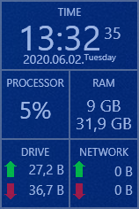

<h1>Performance Viewer</h1>
 
<h3>Displays the following information:</h3>
<ul>
  <li>Digital Clock</li>
  <li>CPU usage</li>
  <li>RAN usage</li>
  <li>Disk (Write/Read)</li>
  <li>Network usage (upload/download)</li>
  <li>Battery charge level (if you have battery)</li>
</ul>
<h3>Support</h3>
<ul>
  <li>Multi monitor</li>
  <li>Resume where she left off</li>
  <ul>
     

