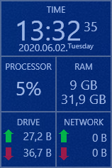

# Performance Viewer
### Displays the following information:
* Digital Clock
* CPU usage
* RAN usage
* Disk (Write/Read)
* Network usage (upload/download)
* Battery charge level (if you have battery)
### Support
* Multi monitor
* Resume where she left off

